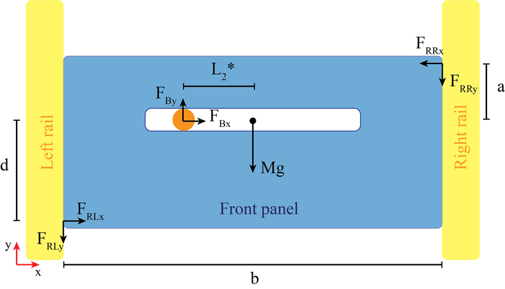
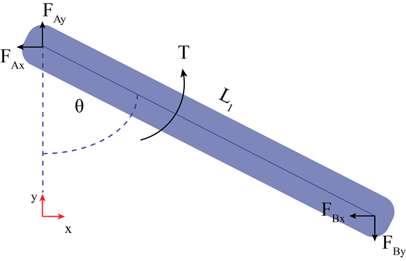

# MBot_forklift
Welcome, this repository is about a Forklift Design for the Botlab competition at ROB550: Robotics Systems Laboratory, from the University of Michigan. I took this class in fall 2023, at my first semester of my MS in robotics. 

ROB550 is divided into two projects: Armlab, and Botlab. Students are divided in groups of three, and for the botlab, each of them gets an MBOT (Michigan's educational bot). For this part of the class we had to calibrate the motors, implement the velocity and position control for the robot, SLAM, path planning, and design a forklift for a new special task for this year's competition.

This repository presents:
- A video demonstration
- The design principles we had for the forklift.
- The design analysis.
- The design files.

## Video demonstration
[]

## Design principles

The forklift design was guided by three main principles: 1) simplicity, 2) minimize interference with the MBot, and 3) inexpensive and easy to manufacture.

The lifting mechanism converts rotational motion into two linear components, which enabled fast response times and motion achieved via a single actuator. A single servo rotated a solid link, which traveled linearly in a slot attached to the forklift. As the servo rotated, the end of the link moved horizontally in the slot and moved the forklift vertically. The forklift was constrained to move vertically via two rails on either side of the lift. 

The design has 8 main components. We used a hobby servo enabling simple hardware integration and high-level control with an internal feedback control loop for precise motion. The hobby servo used was part of the available components in the class' laboratory. To minimize MBot interference, we designed the forklift as close to the MBot as possible. With the forklift, the turning radius changed from 125 mm to 175 mm, and neither the camera nor the Lidar were occluded at the main positions. The custom parts were manufactured by 3D printing with a FDM Creality Ender 3 V3 SE printer, and by laser cutting acrylic, where both tools are available in the robotics department. Some small components were purchased, including a few fasteners and a bearing that allowed low friction for the linear motion along the slot.

## Design analysis

We performed a simple static force-torque analysis to choose the correct servo motor. We start by analyzing the wrenches involved in the front panel that slides in the lateral rails of the forklift (Fig. [1](#diagram)), and we do the same for the rod that connects the hobby servo to the front panel (Fig. [2](#rod)). 

Assumptions:
- The center of mass of the front panel lies on the horizontal path were the bearing moves.
- Coulomb friction model.
- The contact force between the bearing and the front panel is normal to the surface: *FxB = 0*.
- The contact points between the front panel and the lateral rails lie on opposite extreme points, and exists due to the torque produce by the connecting rod into the front panel.

Given that the sum of forces and torques are equal to zero, we can derive the following expressions:

As *FBx = 0*, then *FRLx = FRRx = FRx*. By coulomb friction model we know that *FRLy = μ FRLx = μ FRx* and the same happens for *FRRy = μ FRx*. Combining this information with the equations above we get the following expression:

Following the same procedure for the rod connecting the servo motor and the front panel, we get the following equations:

What we are left to define is *L2**, which if we consider the distance in *x* between the motor shaft and the center of mass of the front panel as *c*, it can be expressed as *L2* = c - L1 sin(θ)*. In this design *c = 64.8* mm.

In order to give values to the different constants, we now define two more parameters: the vertical stroke *s* of the forklift and the total angular displacement *ω* for that stroke. The vertical stroke is given by the height of the pallets to be lifted, which is around 125 mm. We consider then *s* to be 135 mm and due to some geometrical restrictions of the design *ω = 110°*. We can then relate *L1* with these two parameters as follow:

Plotting the torque *Τ* vs *ω* for the following parameters, gives us an approximation of the required torque for the motor: *μ=0.7*, *M=0.1* Kg, *a=0.04* m, and *d = 0.01* m. The maximum is achieved at the extremes angles, and has a value of 0.091 Nm.

## Design files
The design files can be found in the `design` folder. There you are going to find a fusion 360 file of the forklift assembly, and a bill of materials. In the `STLs` folder the STLs of the 3D printed parts are found, and a dxf for laser cut the front panel.  
